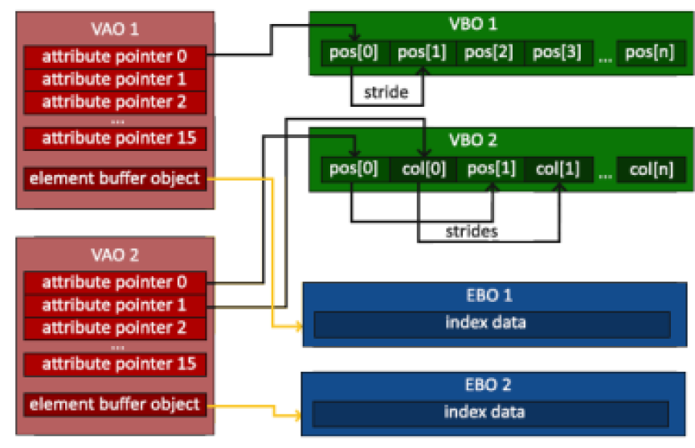

# Lista 1 - Kevin Lima
## 1. O que é a GLSL? Quais os dois tipos de shaders são obrigatórios no pipeline programável da versão atual que trabalhamos em aula e o que eles processam?

GLSL é a OpenGL Shading Language, vertex e fragment shaders o estágio de Tesselation e
Geometry são opcionais.

Vertex: Processa cada vértice separadamente, descrevem como tratar um vértice(posições
2d, coordenadas de textura, cor)

Fragment: Processa cada fragmento separadamente, descrevem como tratar uma área (cor,
Z-depth, Alpha value)

## 2. O que são primitivas gráficas? Como fazemos o armazenamento dos vértices na OpenGL?

As primitivas são os elementos gráficos mais simples que podem ser criados dentro de uma
aplicação. Armazenamos através dos VBOs(Vertex Buffer Objects) que são array de dados,
geralmente float e servem para enviar dados dos vértices a GPU como posição, vetores
normais , cores e etc.

## 3. Explique o que é VBO, VAO e EBO, e como se relacionam (se achar mais fácil, pode fazer um gráfico representando a relação entre eles).

VBO: Armazena os vértices
VAO: Armazena atributos pertinente a um vértice
EBO: É como um índice e evita que tenhamos vértices replicados no VBO.

## 4. Analise o código fonte do projeto Hello Triangle. Localize e relacione os conceitos de shaders, VBOs e VAO apresentados até então. Não precisa entregar nada neste exercício.
## 5. Faça o desenho de 2 triângulos na tela. Desenhe eles:
- a. Apenas com o polígono preenchido
- b. Apenas com contorno
- c. Apenas como pontos
- d. Com as 3 formas de desenho juntas

respostas disponiveis no https://github.com/kevinlimak10/FundCG/tree/main/lista1/exercicio5

## 6. Faça o desenho de um círculo na tela, utilizando a equação paramétrica do círculo para gerar os vértices. Depois disso:
- a) Desenhe um octágono
- b) Desenhe um pentágono
- c) Desenhe um pac-man!
- d) Desenhe uma fatia de pizza
- e) DESAFIO: desenhe uma “estrela”

Respostas disponiveis em https://github.com/kevinlimak10/FundCG/tree/main/lista1/exercicio6

## 7. Desenhe uma espiral:

resposta em https://github.com/kevinlimak10/FundCG/tree/main/lista1/exercicio7

